# MercadaDos

#### _Gerenciador de Registros_

***
#### Desenvolvido por:
- [Cleber Alexandre Souza Júnior](https://github.com/SouzaCleber98)
- Guilherme Garcia
- [Letícia Cristina Leme](https://github.com/leticiaaleme)
- Mateus de Oliveira
- [Murilo Camillo Martins](https://github.com/MuriloCamillo)
***
## Introdução
Neste projeto, desenvolvemos um Gerenciador de Dados Cadastrais visando a implantação em depósitos de supermercados, que permite aos usuários inserirem, alterarem, excluírem e fizessem buscas nos cadastros dos clientes da empresa, auxiliando no planejamento logístico na hora das entregas. O objetivo principal é fornecer uma ferramenta versátil e amigável que atenda às necessidades do cliente, facilitando o trabalho dos entregadores que farão a rota de entregas.
### Visão do produto
Para administradores de mercados que buscam praticidade e eficiência no gerenciamento de registros pessoais de seus clientes, o MercadaDos é um sistema de cadastro e consulta de dados que oferece uma estrutura organizada e de fácil acesso. Ao evitar as dificuldades e o tempo gasto na busca manual de informações, nosso produto utiliza árvores binárias e listas duplamente ligadas para garantir uma rápida inserção, pesquisa e exclusão de registros, além de relatórios ordenados por nome, proporcionando uma experiência organizada e ágil aos usuários, facilitando a logística na hora das entregas.
***

## Product Backlog

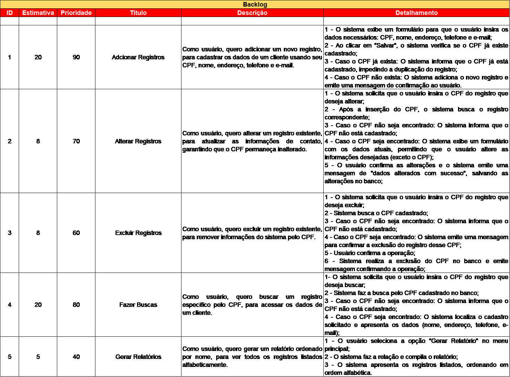

## Requisitos não funcionais

-	O sistema deve realizar as operações com um tempo de resposta de no máximo 5 segundos.
-	O sistema deve garantir que os dados gravados não sejam perdidos;
-	O sistema deve garantir que os dados não sejam vazados;
-	O sistema deve apresentar uma interface intuitiva ao usuário;

***
## Diagramas da UML

### Diagrama de Caso de Uso

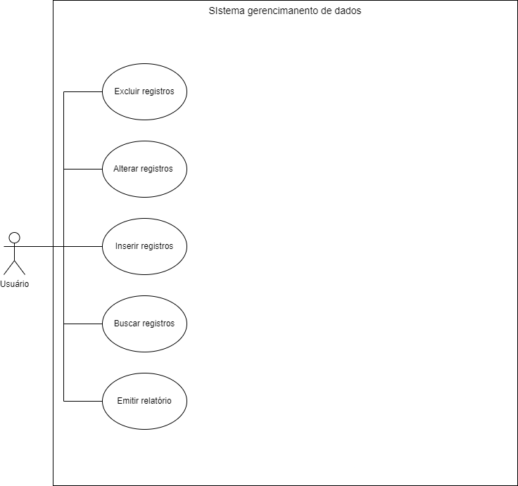

### Descrição dos Fluxos de Eventos

Fluxo Básico
1.	O usuário seleciona a opção "Adicionar Registro";
2.	O sistema exibe um formulário para preenchimento dos dados (CPF, nome, endereço, telefone e e-mail);
3.	O usuário insere os dados e confirma a adição;
4.	O sistema verifica se o CPF informado já existe;
5.	Se o CPF não existir, o sistema adiciona o registro e exibe uma mensagem de confirmação.
   
Adicionar Registros - Fluxo Alternativo
4.1.	Caso o CPF já estiver cadastrado, o sistema emite uma mensagem de aviso informando “CPF já existente” e solicita que o usuário insira outro, retornando para o passo 3.

Alterar Registros - Fluxo Básico 
1.	O usuário seleciona a opção "Alterar Registro";
2.	O sistema solicita que o usuário insira o CPF do registro a ser alterado;
3.	O usuário insere o CPF e confirma;
4.	O sistema verifica se o CPF existe;
5.	Se o CPF existir, o sistema exibe os dados do registro para edição;
6.	O usuário altera os dados e confirma;
7.	O sistema salva as alterações e exibe uma mensagem de confirmação.
   
Alterar Registros - Fluxo Alternativo
4.1.	Caso o CPF não estiver cadastrado, o sistema emite uma mensagem de aviso informando “CPF não existe” e solicita que o usuário insira outro, retornando para o passo 2.

Excluir Registros - Fluxo Básico 
1.	O usuário seleciona a opção "Excluir Registro";
2.	O sistema solicita que o usuário insira o CPF do registro a ser excluído;
3.	O usuário insere o CPF e confirma;
4.	O sistema verifica se o CPF informado existe;
5.	Se o CPF existir, o sistema emite uma mensagem confirmando a operação;
6.	Usuário confirma a operação;
7.	Sistema exclui o registro e exibe uma mensagem de confirmação.
   
Excluir Registros - Fluxo Alternativo
4.1.	Caso o CPF não estiver cadastrado, o sistema emite uma mensagem de aviso informando “CPF não existe” e solicita que o usuário insira outro, retornando para o passo 2.

Buscar Registros - Fluxo Básico 
1.	O usuário seleciona a opção "Buscar Registro";
2.	O sistema solicita que o usuário insira o CPF do registro que deseja buscar;
3.	O usuário insere o CPF e confirma;
4.	O sistema verifica se o CPF informado existe;
5.	Se o CPF existir, o sistema exibe os dados do registro.
Buscar Registros - Fluxo Alternativo
4.1.	Caso o CPF não estiver cadastrado, o sistema emite uma mensagem de aviso informando “CPF não existe” e solicita que o usuário insira outro, retornando para o passo 2.

Gerar Relatório - Fluxo Básico 
1.	O usuário seleciona a opção "Gerar Relatório";
2.	O sistema organiza os registros em ordem alfabética;
3.	O sistema gera um relatório com todos os registros, incluindo CPF, nome, endereço, telefone e e-mail;
4.	O sistema exibe o relatório na tela


### Diagrama de Atividades

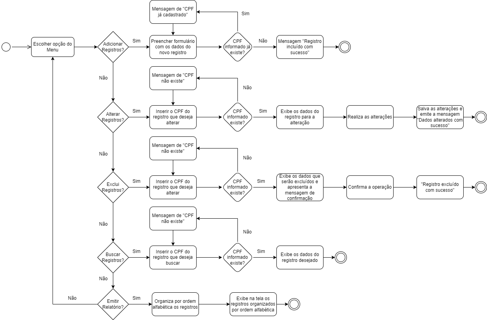


### Modelagem de Classes

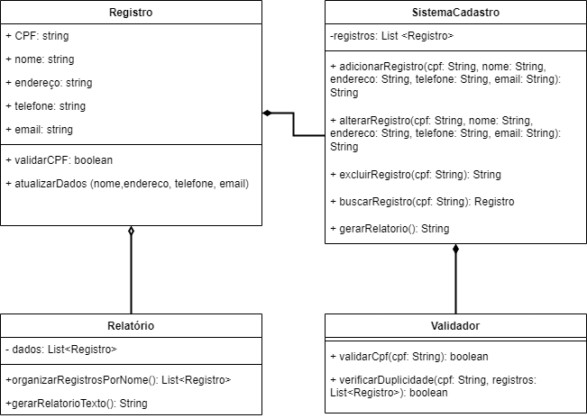


***

## Problemas e Soluções
Durante o desenvolvimento do projeto a equipe encontrou dois potenciais problemas que poderiam vir a ocorrer, apontados já durante a fase inicial. O primeiro seria o cenário onde o usuário da aplicação, ao inserir os dados cadastrais do campo CPF, o faz utilizando de letras e/ou caracteres especiais, causando problema na coleta dos dados. Para a solução do problema, a equipe buscou implementar validações de entrada para que apenas caracteres numerais sejam aceitos, além de limitar o número de caracteres específicos para o campo CPF em onze (número padrão). Caso o usuário insira de forma errada os valores esperados para o campo, o sistema retornará uma mensagem de aviso, e solicitará que insira novamente os dados.
O segundo problema seria a perda de registros, caso o usuário da aplicação no momento de fazer a exclusão de um registro, se confundisse e inserisse o número de CPF errado para ser excluído. A fim de evitar essa situação o sistema emitirá uma mensagem de aviso ao usuário, para que este confirme a sua operação.
***

## Conclusão
Após o desenvolvimento deste projeto, concluímos que o MercadaDos oferece uma solução robusta e eficaz para manipulação de dados cadastrais. Com uma interface amigável e intuitiva, o aplicativo atende às necessidades dos usuários (colaboradores da rede), proporcionando um auxílio na hora destes realizarem o planejamento logístico das entregas do mercado. Este projeto demonstra nossa capacidade de criar ferramentas versáteis que agregam valor ao facilitar tarefas cotidianas do cenário de um sistema de entregas de uma rede de supermercados, contribuindo para a praticidade e eficiência no dia a dia.
***

## Referências
GeeksforGeeks - Linguagem C
TutorialsPoint - Guia sobre C
GeeksforGeeks - Estruturas de Dados e Algoritmos
Canal Programar Em – Professor Nava
OpenAI (ChatGPT)
Google Gemini AI


- ### Guia de Usuário

O usuário ao acessar o sistema se depara com uma interface simples que lhe oferece cinco opções: “Adicionar”, “Alterar”, “Excluir”, “Procurar” e a funcionalidade de “Gerar relatórios”.

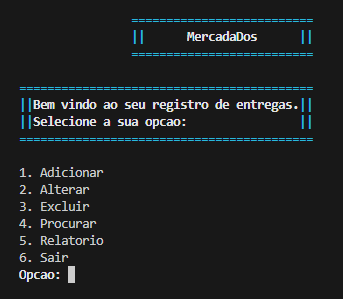

Caso o usuário selecione “Adicionar”, será pedido para que ele informe CPF, Nome, E-mail, Endereço e Telefone da pessoa que deseja cadastrar.

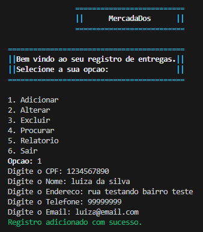

Se ocorrer do usuário colocar caracteres inválidos ou um número menor ou superior ao esperado para o campo CPF, o sistema apresentará uma mensagem de aviso.

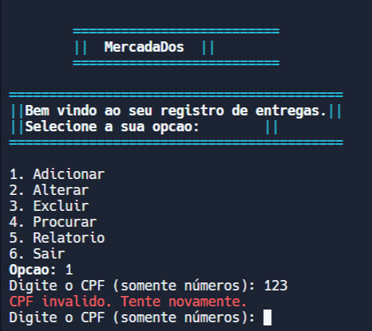

Caso o usuário selecione “Alterar”, será pedido que ele informe o CPF do cadastro a ser alterado. Ele poderá alterar qualquer campo que desejar e, caso não queira alterar um campo específico, basta apertar a tecla <Enter>.

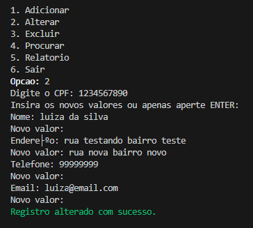

Ao fim do processo, o usuário deve confirmar a operação.

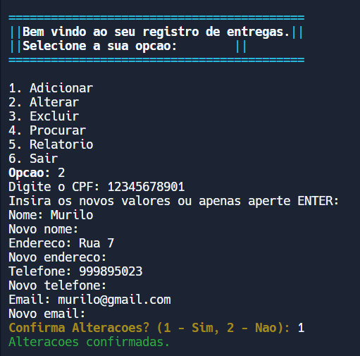

Caso o usuário selecionar a opção “Excluir”, será pedido que ele informe o CPF a ser apagado dos registros. Ao fim do processo o usuário deve confirmar a ação da exclusão.

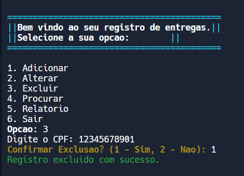

Caso o usuário selecione a opção “Procurar”, ele deverá informar o CPF a ser procurado e o sistema retornará os dados completos.

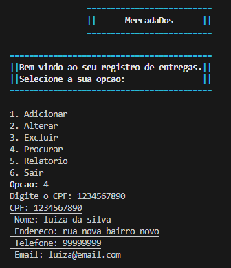

Caso a opção selecionada seja a de “Relatório”, o sistema retornará todos os registros cadastrados em ordem alfabética, além de criar um arquivo .txt contendo as informações.

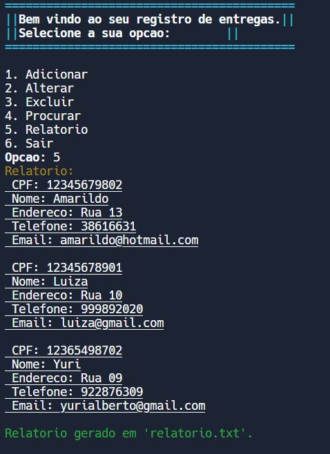


***

## Como utilizar

- Clone o repositório para o seu ambiente local:
```c
git clone https://github.com/leticiaaleme/projeto-mercadados.git
```

- Abra o projeto na IDE de preferência;
  
- Execute o projeto para iniciar o MercadaDos;

- Siga as instruções fornecidas na interface. 
